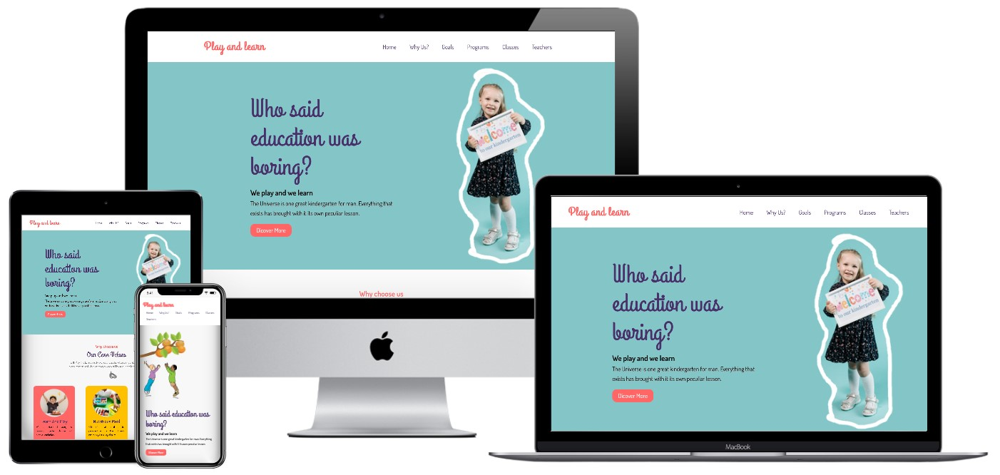

# play-and-learn
### Frontend Development practice project #001 | "Only HTML and CSS. :no_entry_sign:No frameworks"


## Table of contents

- [:one: Summary](#:one:-summary)
  - [Screenshots](#screenshots)
- [:two: My process](#:two:-my-process)
  - [Built with](#built-with)
  - [Tools I used](#tools-i-used)
  - [What I learned](#what-i-learned)
- [:three: Connect with me](#:three:-connect-with-me)
- [:four: Acknowledgments](#:four:-acknowledgments)
- [:five: Asset Links](#:five:-asset-links)
    - [fonts](#fonts)
    - [images and svgs](#images-and-svgs)
    - [Color Palette](#color-palette)

## :one: Summary

:hash: **About the project** :arrow_down:

This is a practice project of my frontend development practice project series. Where I want to gain more experience in Website Design and UI/UX Design. While doing this project I have learned and gained some clear thoughts about :ballot_box_with_check:CSS position property, :ballot_box_with_check:CSS content properties and also sharpen my knowledge of :ballot_box_with_check:Responsive Website Designing and :ballot_box_with_check: Modern CSS technologies.

:hash: **About the website** :arrow_down:

This is basically a school website where schools can use it as their portfolio and sell their school programs and clients can get an overview of the school and book a class for their child.

### Screenshots

#### Full Responsive


## :two: My Process

### Built with
- Semantic HTML5 markup
- CSS custom properties
- Modern CSS technologies
- Mobile-first workflow
- Flexbox
- CSS Grid
- CSS Animation

### Tools I used
- Visual studio code
- pixlr.com // for edit images.
- Firefox developer tool
- Figma

### What I Learned
While doing this project I have learned and gained some clear thoughts about :ballot_box_with_check:CSS position property, :ballot_box_with_check:CSS content properties and also sharpen my knowledge of :ballot_box_with_check:Responsive Website Designing and :ballot_box_with_check: Modern CSS technologies. And also learned how to play with SVG files. Where I can select every part of it and make an animation. Also making it responsive was very tough because I am not using CSS frameworks. But using modern CSS it makes easy to make a responsive layout.

## :three: Connect with me

- Website - [Shariful Pradhan Hridoy](https://shariful-pradhan-hridoy.netlify.com/)
- Twitter - [@sharifulhridoy2](https://twitter.com/SharifulHridoy2)
- LinkedIn - [@sharifulhridoy2](https://www.linkedin.com/in/sharifulhridoy2/)
- Whatsapp - [+880 1785-018296](https://wa.me/8801785018296)
- Medium - [@sharifulpradhanhridoy](https://sharifulpradhanhridoy.medium.com/)

## :four: Acknowledgments
For Design knowledges I regularly follow Design Course and Kevin Powel YouTube channel.

## :five: Asset Links

### Fonts
<a href="https://fonts.googleapis.com/css2?family=Dosis:wght@400;600&family=Grand+Hotel&display=swap">Dosis</a>

### Images and SVGs

<a href='https://www.pexels.com/photo/girl-holding-a-placard-8422001/'>Photo by Pavel Danilyuk from Pexels</a>

<a href="https://www.freepik.com/photos/students-classroom">Students in classroom photo created by rawpixel.com - www.freepik.com</a>

<a href='https://www.freepik.com/photos/kid-with-laptop'>Kid with laptop photo created by gpointstudio - www.freepik.com</a>

<a href='https://www.freepik.com/photos/school-lunch'>School lunch photo created by rawpixel.com - www.freepik.com</a>

<a href='https://www.pexels.com/photo/children-painting-with-water-colors-8612967/'>Photo by Yan Krukov from Pexels</a>

<a href='https://www.pexels.com/photo/children-s-team-building-on-green-grassland-296301/'>Photo by Lukas from Pexels</a>

<a href='https://www.pexels.com/photo/person-holding-yellow-and-pink-lego-blocks-298825/'>Photo by Markus Spiske from Pexels</a>

### Color Palette
```
:root {
  /* color palette */
  --cyber-grape: #49306bff;
  --cyber-grape-2: #635380ff;
  --mountbatten-pink: #90708cff;
  --celadon: #ace4aaff;
  --almond: #e1cdb5ff;
  --text-brand: #FF6666;
  --bg-brand: #FF6666;
  --link-text: #fff;
  --text-gray: rgb(106, 106, 106);
```
